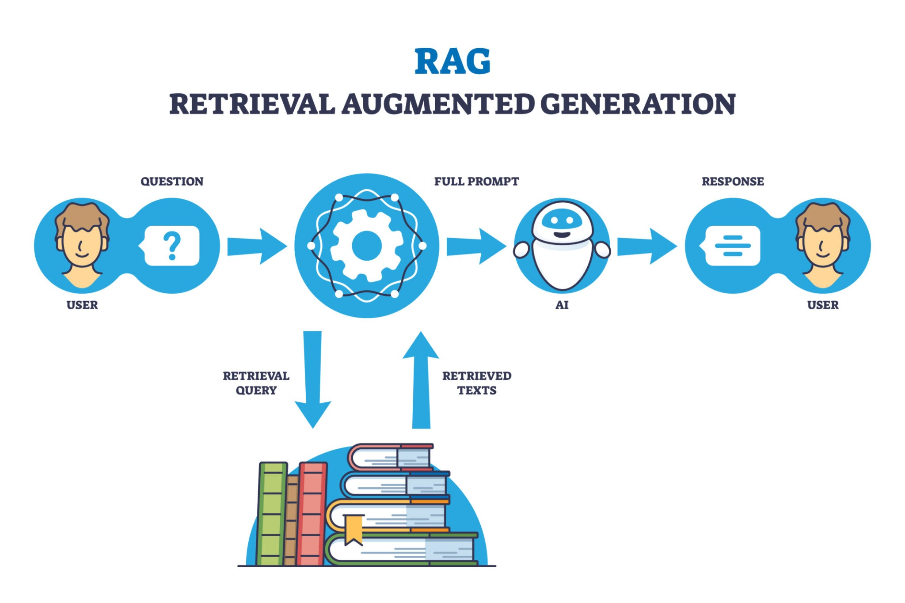

**程序并没有“训练”模型（改变大脑的结构），而是给了模型“笔记”（扩展了大脑的上下文）。**

这就好比：你不用重新去学校读四年书（**Training**）来学会解一道新数学题，你只需要翻开教科书找到类似的例题（**Retrieval**），照猫画虎就能解出来。

这种技术在 AI 领域被称为 **RAG (Retrieval-Augmented Generation)** 和 **In-Context Learning (上下文学习)**。

-----

### 1\. 核心机制：RAG (检索增强生成)

你的系统目前处于 **"Memory-Based" (基于记忆)** 的阶段，而不是 **"Weight-Based" (基于权重)** 的阶段。

[[Image]./RAG.jpeg]



让我们看看你的 `server.py` 实际上做了什么：

1.  **Recording (记笔记)**:

      * 当你录制 "Click Colors" 时，代码把 `[Sidebar > Colors]` 这里的操作步骤存进了 **ChromaDB**。
      * 这就像在笔记本上写下：“遇到‘点击 Colors’的任务时，要找 ID 为 X 的元素。”

2.  **Retrieval (翻笔记)**:

      * 当你再次输入 "Click Colors" 时，`server.py` 并没有直接让 DeepSeek 去猜。
      * 它先去 ChromaDB 搜索：“以前有没有做过类似的事？”
      * ChromaDB 说：“有！上次你是这么做的...”。

3.  **Generation (照着做)**:

      * `server.py` 把查到的“旧操作”拼接到 Prompt 里，发送给 DeepSeek。
      * **关键点**：此时 DeepSeek 收到的 Prompt 其实是这样的：

    <!-- end list -->

    ```text
    System: You are a web agent.

    ### REFERENCE DEMONSTRATION (I found this in memory):
    Step 1: Click on element "<a ...> Colors"

    User: Please Click Colors.
    Current UI: [ID: 15] <a> Colors ...
    ```

      * DeepSeek 看到这个 Prompt，它**不需要**真的懂什么是 Colors，它只需要**模仿**参考答案，发现当前的 `ID: 15` 和参考答案里的描述很像，于是输出了 `click('15')`。

-----

### 2\. 为什么 AI 不需要训练就能懂？(In-Context Learning)

这是大语言模型（LLM）最神奇的能力：**In-Context Learning (上下文学习)**。

  * **传统软件**：必须写死 `if command == "Click Colors" then click(id=5)`。
  * **神经网络训练**：必须给模型看 1000 次点击 Colors 的图片，修改它的神经元连接，它才能记住。
  * **LLM (DeepSeek)**：它已经读过互联网上所有的书，它具备\*\*“通用推理能力”**。当你把“参考答案”放在 Prompt (上下文) 里发给它时，它能瞬间理解这种**模式 (Pattern)\*\* 并应用到新情况中。

**它不是学会了“点击 Colors”这个技能，它是利用了“阅读理解”和“模仿”的通用能力。**

-----

### 3\. 对比：现在的“记忆” vs 未来的“训练”

为了让你更清楚这两种路径的区别，我做了一个对比表：

| 特性 | 现在的方案 (RAG / Memory) | 未来的方案 (Fine-tuning / Training) |
| :--- | :--- | :--- |
| **原理** | **开卷考试** (带着教科书进考场) | **闭卷考试** (把知识背进脑子里) |
| **模型权重** | **不变** (DeepSeek 还是原来的 DeepSeek) | **改变** (变成了 DeepSeek-MyVersion) |
| **数据流向** | 存入 ChromaDB -\> 放入 Prompt -\> LLM | 存入 JSONL -\> 跑 `train.py` -\> 更新权重文件 |
| **即时性** | **即时生效** (录完马上就能用) | **延迟生效** (需要跑几小时训练才行) |
| **上下文限制** | 受限于 Prompt 长度 (记忆太多塞不下) | 无限制 (知识内化了，不需要塞 Prompt) |
| **成本** | 推理成本高 (每次都要发很长的 Prompt) | 推理成本低 (Prompt 很短，因为模型已经懂了) |

### 总结

你现在的程序之所以“看起来”像学会了，是因为你构建了一个**强大的外挂记忆体 (ChromaDB)**。

  * **现在**：Agent 像是一个拿着操作手册的实习生，每次做事都要先查手册（查向量库）。
  * **训练后**：Agent 就变成了熟练工，扔掉手册也能下意识地做出正确反应。

这就是为什么我们既要 **ChromaDB (短期快速适应)**，也要 **JSONL + Fine-tuning (长期能力固化)** 的原因。